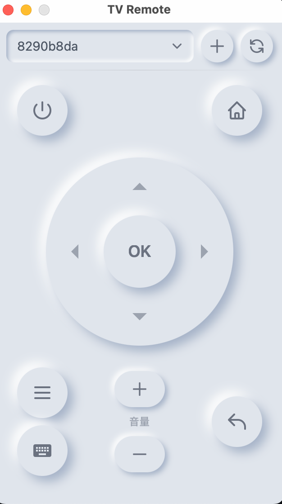

# TV Remote - ADB 遥控器

一个基于 Tauri + Vue 3 的 Mac/Windows 桌面应用，通过 ADB 命令控制 Android TV 设备。



## ✨ 功能

- 🎮 **方向键 + OK** - 导航和确认
- 🏠 **主页/返回/菜单** - 常用控制键
- 🔊 **音量 +/-** - 音量调节
- ⌨️ **字母键盘** - 点击即发送，支持 26 个英文字母
- 📱 **设备管理** - 支持 USB 和 WiFi 连接
- ⌨️ **快捷键** - 支持键盘方向键、Enter、Esc 操作

## 📦 安装

### 方式一：下载安装包

从 [Releases](https://github.com/VonChange/tv-contrl/releases) 下载：
- **Mac**: `TV Remote_x.x.x_aarch64.dmg` (Apple Silicon) 或 `TV Remote_x.x.x_x64.dmg` (Intel)
- **Windows**: `TV Remote_x.x.x_x64.msi`

### 方式二：从源码构建

```bash
# 克隆项目
git clone git@github.com:VonChange/tv-contrl.git
cd tv-contrl

# 安装依赖
npm install

# 开发运行
npm run tauri dev

# 打包
npm run tauri build
```

## 🔧 前置条件

### 安装 ADB

**Mac (Homebrew):**
```bash
brew install android-platform-tools
```

**Mac (Android Studio):**
ADB 通常在 `~/Library/Android/sdk/platform-tools/adb`

**Windows:**
下载 [Android SDK Platform Tools](https://developer.android.com/studio/releases/platform-tools) 并添加到环境变量

### 验证 ADB 安装
```bash
adb version
```

## 📱 连接设备

### USB 连接

1. 在 Android TV 上开启 **开发者选项** 和 **USB 调试**
2. 用 USB 线连接电脑和 TV
3. 在 TV 上允许 USB 调试授权
4. 打开 TV Remote，点击刷新按钮

### WiFi 连接

1. 确保电脑和 TV 在同一局域网
2. 在 TV 上开启 **开发者选项** 和 **网络调试**（或先用 USB 连接后执行 `adb tcpip 5555`）
3. 获取 TV 的 IP 地址（设置 → 网络 → 查看 IP）
4. 打开 TV Remote，点击 **+** 按钮
5. 输入 `IP:5555`（如 `192.168.1.100:5555`）
6. 点击连接

## 🎮 使用说明

### 按钮功能

| 按钮 | 功能 |
|------|------|
| ⏻ | 电源开关 |
| 🏠 | 主页 |
| ▲▼◀▶ | 方向导航 |
| OK | 确认选择 |
| ↩ | 返回 |
| ≡ | 菜单 |
| +/- | 音量增减 |
| ⌨️ | 打开字母键盘 |

### 键盘快捷键

| 快捷键 | 功能 |
|--------|------|
| ↑↓←→ | 方向导航 |
| Enter | 确认 (OK) |
| Esc / Backspace | 返回 |

### 字母键盘

点击 ⌨️ 按钮打开字母键盘，点击任意字母直接发送到 TV（用于搜索输入等场景）。

## 🛠 技术栈

- **前端**: Vue 3 + TypeScript + TailwindCSS
- **后端**: Tauri (Rust)
- **UI 风格**: 新拟物 (Neumorphism)
- **打包体积**: ~10MB

## 📁 项目结构

```
tv-contrl/
├── src/                        # Vue 前端
│   ├── components/
│   │   ├── device/             # 设备选择、WiFi连接
│   │   ├── remote/             # 遥控器按钮
│   │   └── keyboard/           # 字母键盘
│   ├── composables/useAdb.ts   # ADB 操作封装
│   └── constants/keycodes.ts   # KeyCode 定义
├── src-tauri/                  # Rust 后端
│   └── src/adb.rs              # ADB 命令执行
└── plan/                       # 设计文档
```

## 🐛 常见问题

### Q: 提示 "ADB 未找到"
A: 请确保已安装 ADB 并添加到系统 PATH，或安装在以下常见位置：
- Mac: `~/Library/Android/sdk/platform-tools/adb`
- Windows: `%LOCALAPPDATA%\Android\Sdk\platform-tools\adb.exe`

### Q: WiFi 连接失败
A: 
1. 确保 TV 和电脑在同一局域网
2. 检查 TV 的网络调试是否开启
3. 确认 IP 地址正确
4. 尝试先用 USB 连接，执行 `adb tcpip 5555`，再断开 USB 用 WiFi 连接

### Q: 设备显示 "unauthorized"
A: 在 TV 上查看是否有授权弹窗，点击允许。

## 📄 License

MIT

